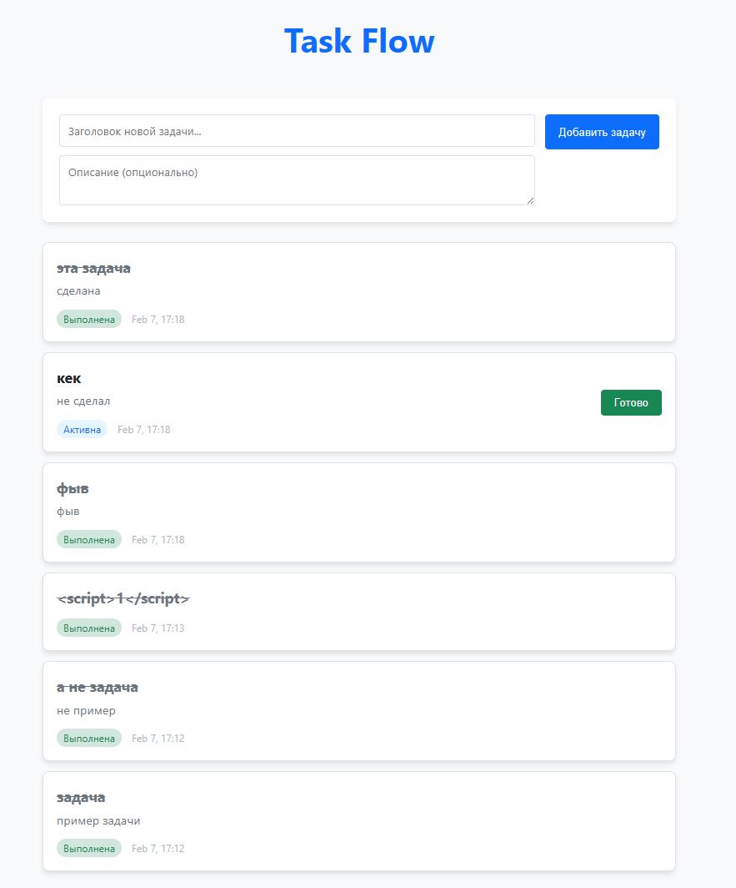
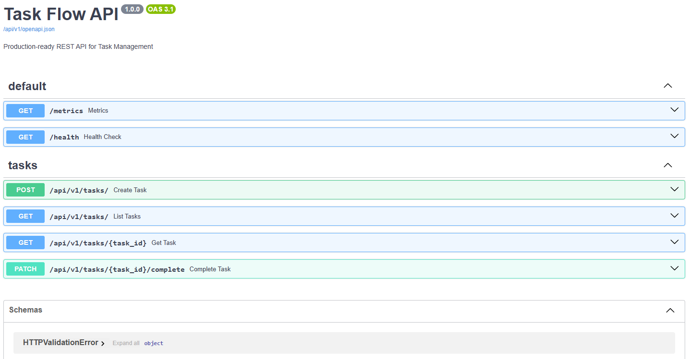
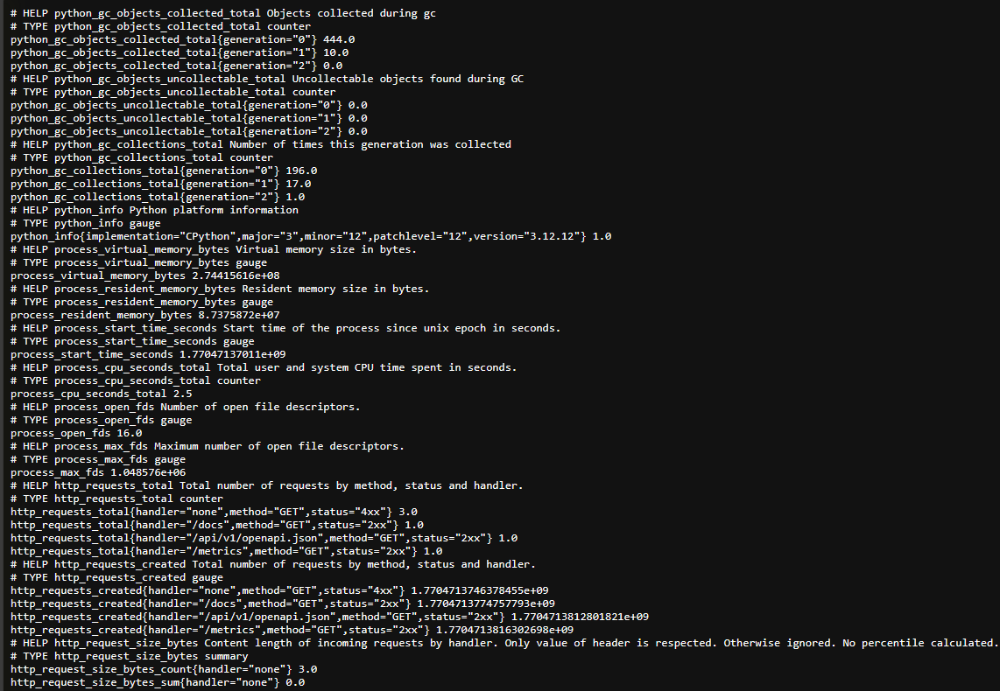
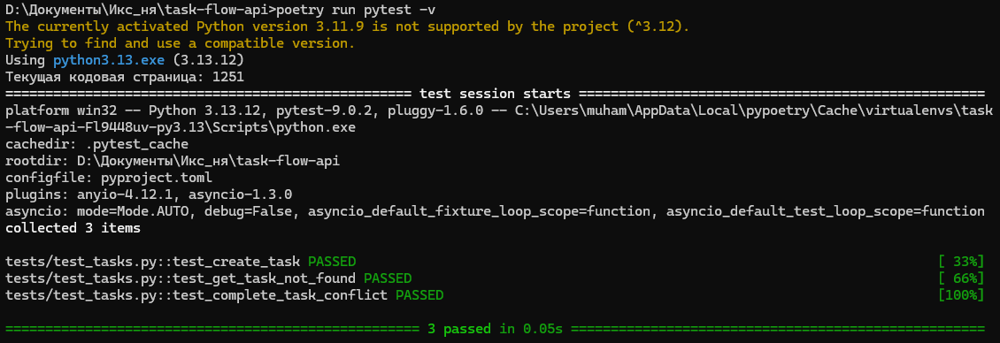

# Task Flow API & Frontend

Полнофункциональное MVP-решение для управления задачами.

## Скриншоты

| **Frontend SPA** | **Swagger API Docs** |
|:---:|:---:|
|  |  |

| **Prometheus Metrics** | **Pytest Results** |
|:---:|:---:|
|  |  |

## 🛠 Стек
- **Backend**: Python 3.12, FastAPI, PostgreSQL (Asyncpg), SQLAlchemy 2.0, Alembic.
- **Frontend**: React 19, TypeScript, Vite, TanStack Query.
- **Infrastructure**: Docker Compose, GitHub Actions (CI), Prometheus Metrics, JSON Logging.

## Быстрый запуск
```bash
docker-compose up --build -d
```
- **Frontend**: [http://localhost:3000](http://localhost:3000)
- **API Docs**: [http://localhost:8000/docs](http://localhost:8000/docs)
- **Metrics**: [http://localhost:8000/metrics](http://localhost:8000/metrics)

## Что реализовано
- **Clean Architecture**: Четкое разделение на слои (API, Service, Repository, Model).
- **Frontend**: Современный SPA на TypeScript с реактивным обновлением данных.
- **Observability**: Структурированные JSON-логи и экспорт метрик для Prometheus.
- **Reliability**: Интеграционные тесты бэкенда и автоматизированный CI-пайплайн.

## Возможное развитие (Roadmap)
Текущая версия — это качественный MVP, созданный в рамках 2-дневного дедлайна. Проект готов к масштабированию:
1. **Observability**: Подключение Sentry и Grafana.
2. **Testing**: Внедрение E2E-тестов на Playwright.
3. **Security**: JWT-авторизация и ролевая модель доступа.
4. **DevOps**: Настройка автоматического деплоя (CD) и K8s манифестов.
